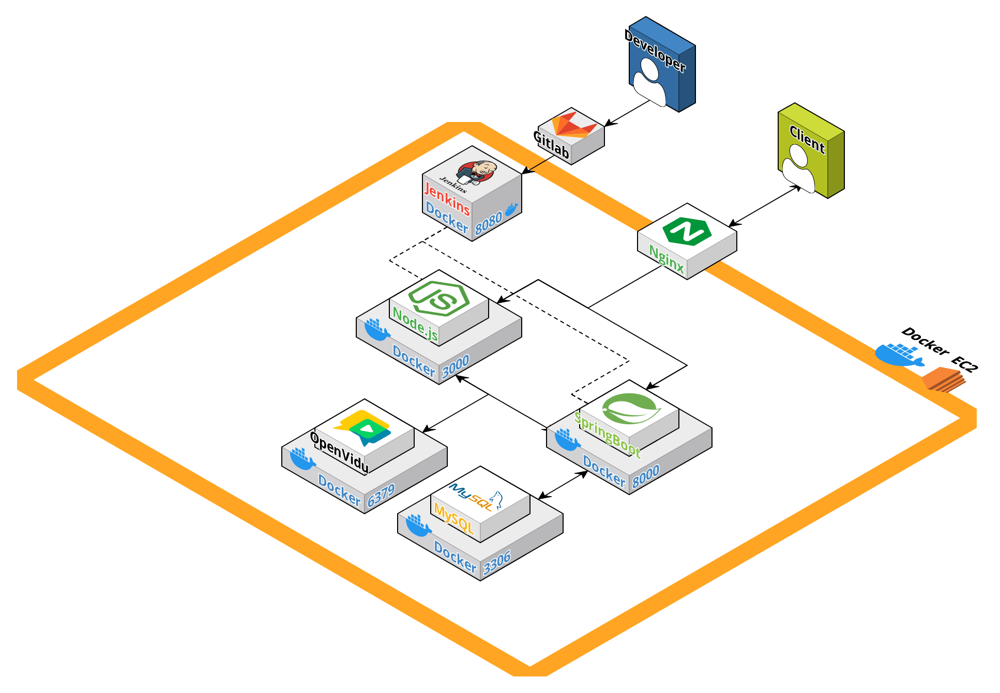

# 👩‍🏫 PLOUD - 스피치 능력을 향상시키는 가장 빠른 방법


## 🕞 프로젝트 진행 기간
**2024.01.08 ~ 2024.02.16** (6주)

<br>

# 📊 PLOUD
사람들 앞에서 말하기가 두려우신가요?  
발표를 더 잘하고 싶지는 않으신가요?  
**PLOUD**와 함께 스피치 능력을 향상시켜 보는 건 어떨까요?  
반복 연습을 통해 자신감을, 발표 평가를 통해 피드백을 받으며 🌟**성장하는 스스로의 모습**🌟을 만나보세요!

<br>

## 💬 주요 기능
- 발화속도, 발화 크기, 명료도 분석을 통한 발표 평가
- webRTC를 이용한 실시간 스터디
- 다른 사람들의 직접적인 피드백을 통한 성장
- 반복 연습을 통한 자신감 상승
- 기록에 따라 증가하는 티어와 그래프를 보며 성취감 상승

<br>

## 💻 서비스 화면

<br>
  
1. 메인페이지  
  
  
2. 대본 선택  
  
  
3. 혼자 연습  
  
  
4. 스터디 페이지
  
  
5. 마이페이지  
  
  
6. 결과페이지  
  
  
7. 게시판  
  

<br>

## 👩‍💻 개발 환경

<a name="item-three"></a>

||일정관리|형상관리|코드리뷰|커뮤니케이션|디자인|UCC|
|:---:|:---:|:---:|:---:|:---:|:---:|:---:|
| **TOOL** |  |  |  |  |  |  |


<br>


#### IDE

 

<br>


#### Frontend

   
     

<br>


#### Backend

  
    
   

<br>

#### DevOPS

   

<br>

## 🏢 아키텍처


## 📂 프로젝트 파일 구조

<details>
<summary><b>FrontEnd</b></summary>

```
📦src
 ┣ 📂app
 ┃ ┣ 📜persistor.jsx
 ┃ ┗ 📜store.jsx
 ┣ 📂components
 ┃ ┣ 📜BarChart.jsx
 ┃ ┣ 📜Button.jsx
 ┃ ┣ 📜Card.jsx
 ┃ ┣ 📜Footer.jsx
 ┃ ┣ 📜Modal.jsx
 ┃ ┣ 📜MyAlert.jsx
 ┃ ┣ 📜MyChart.jsx
 ┃ ┣ 📜Navbar.jsx
 ┃ ┣ 📜Page.jsx
 ┃ ┣ 📜ResultCard.jsx
 ┃ ┣ 📜ScrollToTop.jsx
 ┃ ┣ 📜Tier.jsx
 ┃ ┗ 📜Timer.jsx
 ┣ 📂features
 ┃ ┣ 📂record
 ┃ ┃ ┗ 📜recordSlice.jsx
 ┃ ┣ 📂study
 ┃ ┃ ┗ 📜studySlice.jsx
 ┃ ┗ 📂user
 ┃ ┃ ┣ 📜signUpSlice.jsx
 ┃ ┃ ┗ 📜userSlice.jsx
 ┣ 📂lib
 ┃ ┗ 📜MyRouter.jsx
 ┣ 📂pages
 ┃ ┣ 📂BoardPage
 ┃ ┃ ┣ 📜BoardDetail.jsx
 ┃ ┃ ┣ 📜CreateBoard.jsx
 ┃ ┃ ┣ 📜index.jsx
 ┃ ┃ ┣ 📜index1.jsx
 ┃ ┃ ┗ 📜PostItem.jsx
 ┃ ┣ 📂LoginPage
 ┃ ┃ ┣ 📂Service
 ┃ ┃ ┃ ┗ 📜AuthHeader.jsx
 ┃ ┃ ┣ 📜Findpw.jsx
 ┃ ┃ ┣ 📜index.jsx
 ┃ ┃ ┗ 📜SocialLogin.jsx
 ┃ ┣ 📂MainPage
 ┃ ┃ ┣ 📜index.jsx
 ┃ ┃ ┗ 📜Slideshow.js
 ┃ ┣ 📂MyPage
 ┃ ┃ ┣ 📜index.jsx
 ┃ ┃ ┣ 📜NoSkipResult.jsx
 ┃ ┃ ┣ 📜PatchInfoPage.jsx
 ┃ ┃ ┣ 📜PracticeResult.jsx
 ┃ ┃ ┗ 📜ResetPwPage.jsx
 ┃ ┣ 📂PracticePage
 ┃ ┃ ┣ 📜index1.jsx
 ┃ ┃ ┣ 📜index2.jsx
 ┃ ┃ ┗ 📜PracticeResult.jsx
 ┃ ┣ 📂PracticeRoomPage
 ┃ ┃ ┗ 📜index.jsx
 ┃ ┣ 📂SingUpPage
 ┃ ┃ ┣ 📜index.jsx
 ┃ ┃ ┣ 📜Step1.jsx
 ┃ ┃ ┣ 📜Step2.jsx
 ┃ ┃ ┗ 📜Step3.jsx
 ┃ ┣ 📂StudyPage
 ┃ ┃ ┣ 📜CreateForm.jsx
 ┃ ┃ ┣ 📜CreateModal.jsx
 ┃ ┃ ┣ 📜index.jsx
 ┃ ┃ ┣ 📜JoinConfirmModal.jsx
 ┃ ┃ ┣ 📜roomCard.jsx
 ┃ ┃ ┗ 📜RoomJoinModal.jsx
 ┃ ┗ 📂StudyRoomPage
 ┃ ┃ ┣ 📂component
 ┃ ┃ ┃ ┣ 📜Chat.jsx
 ┃ ┃ ┃ ┣ 📜Loading.jsx
 ┃ ┃ ┃ ┣ 📜Loading2.jsx
 ┃ ┃ ┃ ┣ 📜OvVideo.js
 ┃ ┃ ┃ ┣ 📜Report.jsx
 ┃ ┃ ┃ ┣ 📜ResultList.jsx
 ┃ ┃ ┃ ┣ 📜StudyResult.jsx
 ┃ ┃ ┃ ┣ 📜UserVideo.css
 ┃ ┃ ┃ ┗ 📜UserVideoComponent.js
 ┃ ┃ ┗ 📜index.jsx
 ┣ 📂services
 ┃ ┣ 📜board.jsx
 ┃ ┣ 📜meeting.jsx
 ┃ ┣ 📜record.jsx
 ┃ ┣ 📜script.jsx
 ┃ ┣ 📜sentence.jsx
 ┃ ┣ 📜speech.jsx
 ┃ ┣ 📜statistic.jsx
 ┃ ┗ 📜user.jsx
 ┣ 📂utils
 ┃ ┗ 📜Api.jsx
 ┣ 📜App.jsx
 ┣ 📜awsS3.jsx
 ┣ 📜index.css
 ┗ 📜index.js
```

</details>

<details>
<summary><b>BackEnd</b></summary>

```
📦com.ssafy.ploud
 ┣ 📂common
 ┃ ┣ 📂exception
 ┃ ┃ ┣ 📜CustomException.java
 ┃ ┃ ┣ 📜GlobalExceptionHandler.java
 ┃ ┃ ┗ 📜JwtCustomException.java
 ┃ ┣ 📂response
 ┃ ┃ ┣ 📜ApiResponse.java
 ┃ ┃ ┗ 📜ResponseCode.java
 ┃ ┗ 📜ApiTestController.java
 ┣ 📂config
 ┃ ┣ 📜S3Config.java
 ┃ ┣ 📜SecurityConfig.java
 ┃ ┣ 📜SwaggerConfig.java
 ┃ ┗ 📜WebConfig.java
 ┣ 📂domain
 ┃ ┣ 📂board
 ┃ ┃ ┣ 📂controller
 ┃ ┃ ┃ ┣ 📜BoardController.java
 ┃ ┃ ┃ ┣ 📜CommentController.java
 ┃ ┃ ┃ ┗ 📜HeartController.java
 ┃ ┃ ┣ 📂dto
 ┃ ┃ ┃ ┣ 📂request
 ┃ ┃ ┃ ┃ ┣ 📜BoardRequest.java
 ┃ ┃ ┃ ┃ ┣ 📜CommentRequest.java
 ┃ ┃ ┃ ┃ ┗ 📜HeartRequest.java
 ┃ ┃ ┃ ┗ 📂response
 ┃ ┃ ┃ ┃ ┣ 📜BoardResponse.java
 ┃ ┃ ┃ ┃ ┗ 📜CommentResponse.java
 ┃ ┃ ┣ 📂repository
 ┃ ┃ ┃ ┣ 📜BoardRepository.java
 ┃ ┃ ┃ ┣ 📜CommentRepository.java
 ┃ ┃ ┃ ┗ 📜HeartRepository.java
 ┃ ┃ ┣ 📂service
 ┃ ┃ ┃ ┣ 📜BoardService.java
 ┃ ┃ ┃ ┣ 📜BoardServiceImpl.java
 ┃ ┃ ┃ ┣ 📜CommentService.java
 ┃ ┃ ┃ ┣ 📜CommentServiceImpl.java
 ┃ ┃ ┃ ┣ 📜HeartService.java
 ┃ ┃ ┃ ┗ 📜HeartServiceImpl.java
 ┃ ┃ ┣ 📜BoardEntity.java
 ┃ ┃ ┣ 📜CommentEntity.java
 ┃ ┃ ┗ 📜HeartEntity.java
 ┃ ┣ 📂complain
 ┃ ┃ ┣ 📂controller
 ┃ ┃ ┃ ┗ 📜ComplainController.java
 ┃ ┃ ┣ 📂dto
 ┃ ┃ ┃ ┣ 📜ComplainResponse.java
 ┃ ┃ ┃ ┗ 📜ComplainUserRequestDto.java
 ┃ ┃ ┣ 📂repository
 ┃ ┃ ┃ ┗ 📜ComplainRepository.java
 ┃ ┃ ┣ 📂service
 ┃ ┃ ┃ ┣ 📜ComplainService.java
 ┃ ┃ ┃ ┗ 📜ComplainServiceImpl.java
 ┃ ┃ ┗ 📜ComplainEntity.java
 ┃ ┣ 📂meeting
 ┃ ┃ ┣ 📂controller
 ┃ ┃ ┃ ┗ 📜MeetingController.java
 ┃ ┃ ┣ 📂dto
 ┃ ┃ ┃ ┣ 📂request
 ┃ ┃ ┃ ┃ ┣ 📜MeetingCreateRequest.java
 ┃ ┃ ┃ ┃ ┣ 📜MeetingJoinRequest.java
 ┃ ┃ ┃ ┃ ┣ 📜MeetingLeaveRequest.java
 ┃ ┃ ┃ ┃ ┗ 📜MeetingSearchRequest.java
 ┃ ┃ ┃ ┣ 📂response
 ┃ ┃ ┃ ┃ ┣ 📜MeetingInfoResponse.java
 ┃ ┃ ┃ ┃ ┗ 📜MeetingListResponse.java
 ┃ ┃ ┃ ┗ 📜MeetingInfo.java
 ┃ ┃ ┣ 📂service
 ┃ ┃ ┃ ┣ 📜MeetingService.java
 ┃ ┃ ┃ ┗ 📜MeetingServiceImpl.java
 ┃ ┃ ┗ 📂util
 ┃ ┃ ┃ ┗ 📜OpenViduUtil.java
 ┃ ┣ 📂record
 ┃ ┃ ┣ 📂controller
 ┃ ┃ ┃ ┗ 📜RecordController.java
 ┃ ┃ ┣ 📂dto
 ┃ ┃ ┃ ┣ 📂request
 ┃ ┃ ┃ ┃ ┗ 📜RecordListRequest.java
 ┃ ┃ ┃ ┗ 📂response
 ┃ ┃ ┃ ┃ ┣ 📜FeedbackDetail.java
 ┃ ┃ ┃ ┃ ┣ 📜RecordDetailResponse.java
 ┃ ┃ ┃ ┃ ┣ 📜RecordListResponse.java
 ┃ ┃ ┃ ┃ ┣ 📜ScoreDetail.java
 ┃ ┃ ┃ ┃ ┣ 📜SpeechDetail.java
 ┃ ┃ ┃ ┃ ┣ 📜TotalScoreResponse.java
 ┃ ┃ ┃ ┃ ┗ 📜VideoDetail.java
 ┃ ┃ ┣ 📂repository
 ┃ ┃ ┃ ┣ 📜FeedbackRepository.java
 ┃ ┃ ┃ ┣ 📜ScoreRepository.java
 ┃ ┃ ┃ ┗ 📜VideoRepository.java
 ┃ ┃ ┣ 📂service
 ┃ ┃ ┃ ┣ 📜RecordService.java
 ┃ ┃ ┃ ┗ 📜RecordServiceImpl.java
 ┃ ┃ ┣ 📜FeedbackEntity.java
 ┃ ┃ ┣ 📜ScoreEntity.java
 ┃ ┃ ┗ 📜VideoEntity.java
 ┃ ┣ 📂S3
 ┃ ┃ ┗ 📂service
 ┃ ┃ ┃ ┣ 📜S3Service.java
 ┃ ┃ ┃ ┗ 📜S3ServiceImpl.java
 ┃ ┣ 📂script
 ┃ ┃ ┣ 📂controller
 ┃ ┃ ┃ ┗ 📜ScriptController.java
 ┃ ┃ ┣ 📂dto
 ┃ ┃ ┃ ┗ 📂response
 ┃ ┃ ┃ ┃ ┣ 📜ScriptCategoriesResDto.java
 ┃ ┃ ┃ ┃ ┣ 📜ScriptDetailResDto.java
 ┃ ┃ ┃ ┃ ┣ 📜ScriptInfoDto.java
 ┃ ┃ ┃ ┃ ┗ 📜ScriptListResDto.java
 ┃ ┃ ┣ 📂repository
 ┃ ┃ ┃ ┗ 📜ScriptRepository.java
 ┃ ┃ ┣ 📂service
 ┃ ┃ ┃ ┣ 📜ScriptService.java
 ┃ ┃ ┃ ┗ 📜ScriptServiceImpl.java
 ┃ ┃ ┣ 📜ScriptCategory.java
 ┃ ┃ ┗ 📜ScriptEntity.java
 ┃ ┣ 📂sentence
 ┃ ┃ ┣ 📂controller
 ┃ ┃ ┃ ┗ 📜SentenceController.java
 ┃ ┃ ┣ 📂dto
 ┃ ┃ ┃ ┗ 📜SentenceResponseDto.java
 ┃ ┃ ┣ 📂repository
 ┃ ┃ ┃ ┗ 📜SentenceRepository.java
 ┃ ┃ ┣ 📂service
 ┃ ┃ ┃ ┗ 📜SentenceService.java
 ┃ ┃ ┗ 📜SentenceEntity.java
 ┃ ┣ 📂speech
 ┃ ┃ ┣ 📂controller
 ┃ ┃ ┃ ┗ 📜SpeechController.java
 ┃ ┃ ┣ 📂dto
 ┃ ┃ ┃ ┣ 📂request
 ┃ ┃ ┃ ┃ ┣ 📜CommentRequest.java
 ┃ ┃ ┃ ┃ ┣ 📜FeedbackRequest.java
 ┃ ┃ ┃ ┃ ┣ 📜SpeechEndRequest.java
 ┃ ┃ ┃ ┃ ┣ 📜SpeechStartRequest.java
 ┃ ┃ ┃ ┃ ┗ 📜VideoUploadRequest.java
 ┃ ┃ ┃ ┣ 📂response
 ┃ ┃ ┃ ┃ ┣ 📜ClearityResponse.java
 ┃ ┃ ┃ ┃ ┗ 📜SpeechIdResDto.java
 ┃ ┃ ┃ ┗ 📜ClearityDto.java
 ┃ ┃ ┣ 📂repository
 ┃ ┃ ┃ ┗ 📜SpeechRepository.java
 ┃ ┃ ┣ 📂service
 ┃ ┃ ┃ ┣ 📜SpeechService.java
 ┃ ┃ ┃ ┗ 📜SpeechServiceImpl.java
 ┃ ┃ ┣ 📂util
 ┃ ┃ ┃ ┣ 📜EtriUtil.java
 ┃ ┃ ┃ ┣ 📜FfmpegUtil.java
 ┃ ┃ ┃ ┗ 📜SpeechAssessUtil.java
 ┃ ┃ ┣ 📜SpeechCategory.java
 ┃ ┃ ┗ 📜SpeechEntity.java
 ┃ ┗ 📂user
 ┃ ┃ ┣ 📂controller
 ┃ ┃ ┃ ┣ 📜AuthController.java
 ┃ ┃ ┃ ┗ 📜UserController.java
 ┃ ┃ ┣ 📂dto
 ┃ ┃ ┃ ┣ 📂request
 ┃ ┃ ┃ ┃ ┣ 📜EmailVerifyReqDto.java
 ┃ ┃ ┃ ┃ ┣ 📜FindIdReqDto.java
 ┃ ┃ ┃ ┃ ┣ 📜FindPwReqDto.java
 ┃ ┃ ┃ ┃ ┣ 📜GoogleLoginReqDto.java
 ┃ ┃ ┃ ┃ ┣ 📜LoginReqDto.java
 ┃ ┃ ┃ ┃ ┣ 📜SignUpReqDto.java
 ┃ ┃ ┃ ┃ ┗ 📜UpdatePwReqDto.java
 ┃ ┃ ┃ ┗ 📂response
 ┃ ┃ ┃ ┃ ┣ 📜FindIdResDto.java
 ┃ ┃ ┃ ┃ ┣ 📜JwtAuthResponse.java
 ┃ ┃ ┃ ┃ ┣ 📜LoginResDto.java
 ┃ ┃ ┃ ┃ ┣ 📜UserInfoResDto.java
 ┃ ┃ ┃ ┃ ┣ 📜UserInfoUpdateReqDto.java
 ┃ ┃ ┃ ┃ ┗ 📜VideoInfoResponseDto.java
 ┃ ┃ ┣ 📂repository
 ┃ ┃ ┃ ┗ 📜UserRepository.java
 ┃ ┃ ┣ 📂security
 ┃ ┃ ┃ ┣ 📜AuthService.java
 ┃ ┃ ┃ ┣ 📜CustomUserDetailsService.java
 ┃ ┃ ┃ ┣ 📜JwtAuthenticationEntryPoint.java
 ┃ ┃ ┃ ┣ 📜JwtAuthenticationFilter.java
 ┃ ┃ ┃ ┗ 📜JwtTokenProvider.java
 ┃ ┃ ┣ 📂service
 ┃ ┃ ┃ ┣ 📜EmailSenderService.java
 ┃ ┃ ┃ ┣ 📜UserService.java
 ┃ ┃ ┃ ┗ 📜UserServiceImpl.java
 ┃ ┃ ┣ 📜Role.java
 ┃ ┃ ┗ 📜UserEntity.java
 ┗ 📜BackEndApplication.java
```

</details>

## 📑 프로젝트 산출물
- [기능 명세서](./document/기능명세서.pdf)
- [API 명세서](./document/API명세서.pdf)
- [와이어프레임](./document/와이어프레임.png)
- [ER Diagram](./document/erd.png)
- [포팅메뉴얼](./exec/PortingManual.md)  
- [점수 산출 과정 시퀀스 다이어그림](./document/점수산출과정.png)  


## 👨‍👨‍👧 팀원 👨‍👨‍👧
|Name|박나린|배준형|김가영|김영대|이승집|박민호|
|:---:|:---:|:---:|:---:|:---:|:---:|:---:|
| **Profile**  |  |  |  |  |  |  |
| **Position** | PM <br/> Backend <br/> CI/CD | FrontEnd <br/> OpenVidu | Backend <br/> Design | Backend <br/> 음성분석 | Frontend <br/> UI/UX | Frontend <br/> OpenVidu |
| **Git**      | [GitHub](https://github.com/xw2nana) | [GitHub](https://github.com/junhyung96) | [GitHub](https://github.com/kayoung0) | [GitHub](https://github.com/0dyk) | [GitHub](https://github.com/SeungjipLee) | [GitHub](https://github.com/pmhmist) |
