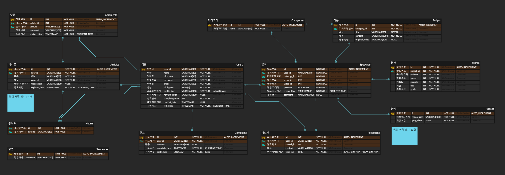
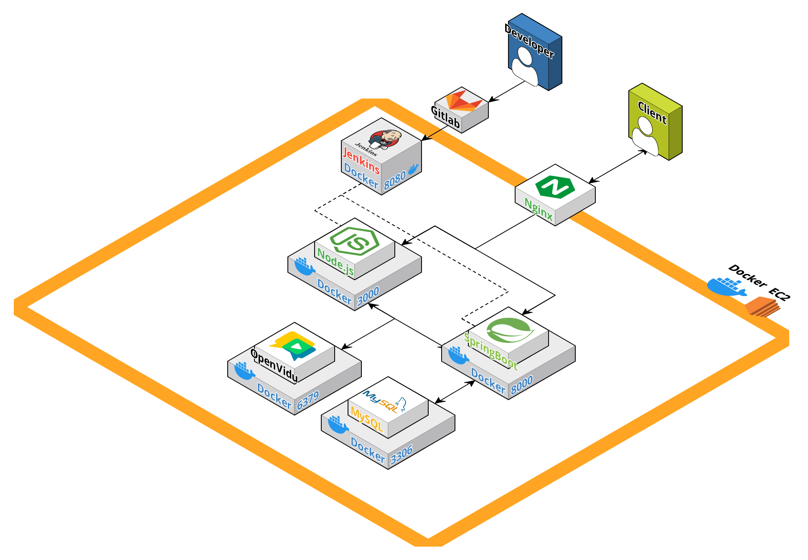

#  PLOUD


## 프로젝트 개요


## 프로젝트 기획 배경


## 주요 서비스


## 서비스 화면


## 개발환경

#### Frontend
- Node.js 20.11.0
- React 18.2
- Axios
- Redux
- openvidu-browser
- Tailwind CSS

#### Backend
- Java 17
- Spring Boot 3.2.1
    - Spring Security
    - JWT
    - Spring Data JPA
    - QueryDSL
    - lombok
    - swagger
    - AWS S3
- Gradle 8.5

#### Database
- MySQL 8.0.35

#### DevOPS
- AWS EC2
- Docker
- Nginx
- Jenkins

#### IDE
- Visual Sudio Code
- Intellij IDEA

#### Tool
- GitLab
- Jira
- Gerrit
- Notion
- Mattermost

#### ETC
- Figma


## ERD


## 아키텍처



## 프로젝트 구조

아이콘
있는 게 좋다 : 1
없는 게 좋다 : 0

<details>
<summary>FrontEnd</summary>

```
📦FrontEnd
 ┣ 📂app
 ┃ ┣ 📜persistor.jsx
 ┃ ┗ 📜store.jsx
 ┣ 📂components
 ┃ ┣ 📜BarChart.jsx
 ┃ ┣ 📜Button.jsx
 ┃ ┣ 📜Card.jsx
 ┃ ┣ 📜Footer.jsx
 ┃ ┣ 📜Modal.jsx
 ┃ ┣ 📜MyChart.jsx
 ┃ ┣ 📜Navbar.jsx
 ┃ ┣ 📜Page.jsx
 ┃ ┣ 📜ResultCard.jsx
 ┃ ┗ 📜Tier.jsx
 ┣ 📂features
 ┃ ┣ 📂record
 ┃ ┃ ┗ 📜recordSlice.jsx
 ┃ ┣ 📂study
 ┃ ┃ ┗ 📜studySlice.jsx
 ┃ ┗ 📂user
 ┃ ┃ ┣ 📜signUpSlice.jsx
 ┃ ┃ ┗ 📜userSlice.jsx
 ┣ 📂lib
 ┃ ┗ 📜MyRouter.jsx
 ┣ 📂pages
 ┃ ┣ 📂BoardPage
 ┃ ┃ ┣ 📜BoardDetail.jsx
 ┃ ┃ ┣ 📜CreateBoard.jsx
 ┃ ┃ ┣ 📜index.jsx
 ┃ ┃ ┣ 📜index1.jsx
 ┃ ┃ ┗ 📜PostItem.jsx
 ┃ ┣ 📂LoginPage
 ┃ ┃ ┣ 📂Service
 ┃ ┃ ┃ ┣ 📜AuthHeader.jsx
 ┃ ┃ ┃ ┗ 📜AuthService.jsx
 ┃ ┃ ┣ 📜Findpw.jsx
 ┃ ┃ ┣ 📜index.jsx
 ┃ ┃ ┗ 📜SocialLogin.jsx
 ┃ ┣ 📂MainPage
 ┃ ┃ ┗ 📜index.jsx
 ┃ ┣ 📂MyPage
 ┃ ┃ ┣ 📜index.jsx
 ┃ ┃ ┣ 📜PatchInfoPage.jsx
 ┃ ┃ ┗ 📜ResetPwPage.jsx
 ┃ ┣ 📂PracticePage
 ┃ ┃ ┣ 📂sidebar
 ┃ ┃ ┃ ┗ 📜Sidebar.jsx
 ┃ ┃ ┣ 📜index.jsx
 ┃ ┃ ┗ 📜PracticeResult.jsx
 ┃ ┣ 📂PracticeRoomPage
 ┃ ┃ ┣ 📜Level1.jsx
 ┃ ┃ ┗ 📜Level2.jsx
 ┃ ┣ 📂SingUpPage
 ┃ ┃ ┣ 📜index.jsx
 ┃ ┃ ┣ 📜Origin.jsx
 ┃ ┃ ┣ 📜Step1.jsx
 ┃ ┃ ┣ 📜Step2.jsx
 ┃ ┃ ┗ 📜Step3.jsx
 ┃ ┣ 📂StudyPage
 ┃ ┃ ┣ 📜CreateForm.jsx
 ┃ ┃ ┣ 📜CreateModal.jsx
 ┃ ┃ ┣ 📜index.jsx
 ┃ ┃ ┣ 📜JoinConfirmModal.jsx
 ┃ ┃ ┣ 📜roomCard.jsx
 ┃ ┃ ┗ 📜RoomJoinModal.jsx
 ┃ ┣ 📂StudyRoomPage
 ┃ ┃ ┣ 📂component
 ┃ ┃ ┃ ┣ 📜Chat.jsx
 ┃ ┃ ┃ ┣ 📜InterviewScreenListener.jsx
 ┃ ┃ ┃ ┣ 📜InterviewScreenPresenter.jsx
 ┃ ┃ ┃ ┣ 📜OvVideo.js
 ┃ ┃ ┃ ┣ 📜Report.jsx
 ┃ ┃ ┃ ┣ 📜ResultList.jsx
 ┃ ┃ ┃ ┣ 📜StudyResult.jsx
 ┃ ┃ ┃ ┣ 📜UserVideo.css
 ┃ ┃ ┃ ┗ 📜UserVideoComponent.js
 ┃ ┃ ┣ 📂videocomponents
 ┃ ┃ ┃ ┣ 📜PresentationLayout.jsx
 ┃ ┃ ┃ ┣ 📜ScreenShareLayout.jsx
 ┃ ┃ ┃ ┗ 📜VideoGrid.jsx
 ┃ ┃ ┗ 📜index.jsx
 ┃ ┗ 📂TestPage
 ┃ ┃ ┣ 📜index.jsx
 ┃ ┃ ┣ 📜Record.jsx
 ┃ ┃ ┗ 📜SpeechResult.jsx
 ┣ 📂services
 ┃ ┣ 📜board.jsx
 ┃ ┣ 📜meeting.jsx
 ┃ ┣ 📜record.jsx
 ┃ ┣ 📜script.jsx
 ┃ ┣ 📜sentence.jsx
 ┃ ┣ 📜speech.jsx
 ┃ ┣ 📜statistic.jsx
 ┃ ┗ 📜user.jsx
 ┣ 📂utils
 ┃ ┗ 📜Api.jsx
 ┣ 📜App.jsx
 ┣ 📜awsS3.jsx
 ┣ 📜index.css
 ┗ 📜index.js
```

</details>

<details>
<summary>BackEnd</summary>

```
com.ssafy.ploud
 ┣ common
 ┃ ┣ exception
 ┃ ┃ ┣ CustomException.java
 ┃ ┃ ┣ GlobalExceptionHandler.java
 ┃ ┃ ┗ JwtCustomException.java
 ┃ ┣ response
 ┃ ┃ ┣ ApiResponse.java
 ┃ ┃ ┗ ResponseCode.java
 ┃ ┗ ApiTestController.java
 ┣ config
 ┃ ┣ S3Config.java
 ┃ ┣ SecurityConfig.java
 ┃ ┣ SwaggerConfig.java
 ┃ ┗ WebConfig.java
 ┣ domain
 ┃ ┣ board
 ┃ ┃ ┣ controller
 ┃ ┃ ┃ ┣ BoardController.java
 ┃ ┃ ┃ ┣ CommentController.java
 ┃ ┃ ┃ ┗ HeartController.java
 ┃ ┃ ┣ dto
 ┃ ┃ ┃ ┣ request
 ┃ ┃ ┃ ┃ ┣ BoardRequest.java
 ┃ ┃ ┃ ┃ ┣ CommentRequest.java
 ┃ ┃ ┃ ┃ ┗ HeartRequest.java
 ┃ ┃ ┃ ┗ response
 ┃ ┃ ┃ ┃ ┣ BoardResponse.java
 ┃ ┃ ┃ ┃ ┗ CommentResponse.java
 ┃ ┃ ┣ repository
 ┃ ┃ ┃ ┣ BoardRepository.java
 ┃ ┃ ┃ ┣ CommentRepository.java
 ┃ ┃ ┃ ┗ HeartRepository.java
 ┃ ┃ ┣ service
 ┃ ┃ ┃ ┣ BoardService.java
 ┃ ┃ ┃ ┣ BoardServiceImpl.java
 ┃ ┃ ┃ ┣ CommentService.java
 ┃ ┃ ┃ ┣ CommentServiceImpl.java
 ┃ ┃ ┃ ┣ HeartService.java
 ┃ ┃ ┃ ┗ HeartServiceImpl.java
 ┃ ┃ ┣ BoardEntity.java
 ┃ ┃ ┣ CommentEntity.java
 ┃ ┃ ┗ HeartEntity.java
 ┃ ┣ complain
 ┃ ┃ ┣ controller
 ┃ ┃ ┃ ┗ ComplainController.java
 ┃ ┃ ┣ dto
 ┃ ┃ ┃ ┣ ComplainResponse.java
 ┃ ┃ ┃ ┗ ComplainUserRequestDto.java
 ┃ ┃ ┣ repository
 ┃ ┃ ┃ ┗ ComplainRepository.java
 ┃ ┃ ┣ service
 ┃ ┃ ┃ ┣ ComplainService.java
 ┃ ┃ ┃ ┗ ComplainServiceImpl.java
 ┃ ┃ ┗ ComplainEntity.java
 ┃ ┣ meeting
 ┃ ┃ ┣ controller
 ┃ ┃ ┃ ┗ MeetingController.java
 ┃ ┃ ┣ dto
 ┃ ┃ ┃ ┣ request
 ┃ ┃ ┃ ┃ ┣ MeetingCreateRequest.java
 ┃ ┃ ┃ ┃ ┣ MeetingJoinRequest.java
 ┃ ┃ ┃ ┃ ┣ MeetingLeaveRequest.java
 ┃ ┃ ┃ ┃ ┗ MeetingSearchRequest.java
 ┃ ┃ ┃ ┣ response
 ┃ ┃ ┃ ┃ ┣ MeetingInfoResponse.java
 ┃ ┃ ┃ ┃ ┗ MeetingListResponse.java
 ┃ ┃ ┃ ┗ MeetingInfo.java
 ┃ ┃ ┣ service
 ┃ ┃ ┃ ┣ MeetingService.java
 ┃ ┃ ┃ ┗ MeetingServiceImpl.java
 ┃ ┃ ┗ util
 ┃ ┃ ┃ ┗ OpenViduUtil.java
 ┃ ┣ record
 ┃ ┃ ┣ controller
 ┃ ┃ ┃ ┗ RecordController.java
 ┃ ┃ ┣ dto
 ┃ ┃ ┃ ┣ request
 ┃ ┃ ┃ ┃ ┗ RecordListRequest.java
 ┃ ┃ ┃ ┗ response
 ┃ ┃ ┃ ┃ ┣ FeedbackDetail.java
 ┃ ┃ ┃ ┃ ┣ RecordDetailResponse.java
 ┃ ┃ ┃ ┃ ┣ RecordListResponse.java
 ┃ ┃ ┃ ┃ ┣ ScoreDetail.java
 ┃ ┃ ┃ ┃ ┣ SpeechDetail.java
 ┃ ┃ ┃ ┃ ┣ TotalScoreResponse.java
 ┃ ┃ ┃ ┃ ┗ VideoDetail.java
 ┃ ┃ ┣ repository
 ┃ ┃ ┃ ┣ FeedbackRepository.java
 ┃ ┃ ┃ ┣ ScoreRepository.java
 ┃ ┃ ┃ ┗ VideoRepository.java
 ┃ ┃ ┣ service
 ┃ ┃ ┃ ┣ RecordService.java
 ┃ ┃ ┃ ┗ RecordServiceImpl.java
 ┃ ┃ ┣ FeedbackEntity.java
 ┃ ┃ ┣ ScoreEntity.java
 ┃ ┃ ┗ VideoEntity.java
 ┃ ┣ S3
 ┃ ┃ ┗ service
 ┃ ┃ ┃ ┣ S3Service.java
 ┃ ┃ ┃ ┗ S3ServiceImpl.java
 ┃ ┣ script
 ┃ ┃ ┣ controller
 ┃ ┃ ┃ ┗ ScriptController.java
 ┃ ┃ ┣ dto
 ┃ ┃ ┃ ┗ response
 ┃ ┃ ┃ ┃ ┣ ScriptCategoriesResDto.java
 ┃ ┃ ┃ ┃ ┣ ScriptDetailResDto.java
 ┃ ┃ ┃ ┃ ┣ ScriptInfoDto.java
 ┃ ┃ ┃ ┃ ┗ ScriptListResDto.java
 ┃ ┃ ┣ repository
 ┃ ┃ ┃ ┗ ScriptRepository.java
 ┃ ┃ ┣ service
 ┃ ┃ ┃ ┣ ScriptService.java
 ┃ ┃ ┃ ┗ ScriptServiceImpl.java
 ┃ ┃ ┣ ScriptCategory.java
 ┃ ┃ ┗ ScriptEntity.java
 ┃ ┣ sentence
 ┃ ┃ ┣ controller
 ┃ ┃ ┃ ┗ SentenceController.java
 ┃ ┃ ┣ dto
 ┃ ┃ ┃ ┗ SentenceResponseDto.java
 ┃ ┃ ┣ repository
 ┃ ┃ ┃ ┗ SentenceRepository.java
 ┃ ┃ ┣ service
 ┃ ┃ ┃ ┗ SentenceService.java
 ┃ ┃ ┗ SentenceEntity.java
 ┃ ┣ speech
 ┃ ┃ ┣ controller
 ┃ ┃ ┃ ┗ SpeechController.java
 ┃ ┃ ┣ dto
 ┃ ┃ ┃ ┣ request
 ┃ ┃ ┃ ┃ ┣ CommentRequest.java
 ┃ ┃ ┃ ┃ ┣ FeedbackRequest.java
 ┃ ┃ ┃ ┃ ┣ SpeechEndRequest.java
 ┃ ┃ ┃ ┃ ┣ SpeechStartRequest.java
 ┃ ┃ ┃ ┃ ┗ VideoUploadRequest.java
 ┃ ┃ ┃ ┣ response
 ┃ ┃ ┃ ┃ ┣ ClearityResponse.java
 ┃ ┃ ┃ ┃ ┗ SpeechIdResDto.java
 ┃ ┃ ┃ ┗ ClearityDto.java
 ┃ ┃ ┣ repository
 ┃ ┃ ┃ ┗ SpeechRepository.java
 ┃ ┃ ┣ service
 ┃ ┃ ┃ ┣ SpeechService.java
 ┃ ┃ ┃ ┗ SpeechServiceImpl.java
 ┃ ┃ ┣ util
 ┃ ┃ ┃ ┣ EtriUtil.java
 ┃ ┃ ┃ ┣ FfmpegUtil.java
 ┃ ┃ ┃ ┗ SpeechAssessUtil.java
 ┃ ┃ ┣ SpeechCategory.java
 ┃ ┃ ┗ SpeechEntity.java
 ┃ ┗ user
 ┃ ┃ ┣ controller
 ┃ ┃ ┃ ┣ AuthController.java
 ┃ ┃ ┃ ┗ UserController.java
 ┃ ┃ ┣ dto
 ┃ ┃ ┃ ┣ request
 ┃ ┃ ┃ ┃ ┣ EmailVerifyReqDto.java
 ┃ ┃ ┃ ┃ ┣ FindIdReqDto.java
 ┃ ┃ ┃ ┃ ┣ FindPwReqDto.java
 ┃ ┃ ┃ ┃ ┣ GoogleLoginReqDto.java
 ┃ ┃ ┃ ┃ ┣ LoginReqDto.java
 ┃ ┃ ┃ ┃ ┣ SignUpReqDto.java
 ┃ ┃ ┃ ┃ ┗ UpdatePwReqDto.java
 ┃ ┃ ┃ ┗ response
 ┃ ┃ ┃ ┃ ┣ FindIdResDto.java
 ┃ ┃ ┃ ┃ ┣ JwtAuthResponse.java
 ┃ ┃ ┃ ┃ ┣ LoginResDto.java
 ┃ ┃ ┃ ┃ ┣ UserInfoResDto.java
 ┃ ┃ ┃ ┃ ┣ UserInfoUpdateReqDto.java
 ┃ ┃ ┃ ┃ ┗ VideoInfoResponseDto.java
 ┃ ┃ ┣ repository
 ┃ ┃ ┃ ┗ UserRepository.java
 ┃ ┃ ┣ security
 ┃ ┃ ┃ ┣ AuthService.java
 ┃ ┃ ┃ ┣ CustomUserDetailsService.java
 ┃ ┃ ┃ ┣ JwtAuthenticationEntryPoint.java
 ┃ ┃ ┃ ┣ JwtAuthenticationFilter.java
 ┃ ┃ ┃ ┗ JwtTokenProvider.java
 ┃ ┃ ┣ service
 ┃ ┃ ┃ ┣ EmailSenderService.java
 ┃ ┃ ┃ ┣ UserService.java
 ┃ ┃ ┃ ┗ UserServiceImpl.java
 ┃ ┃ ┣ Role.java
 ┃ ┃ ┗ UserEntity.java
 ┗ BackEndApplication.java
```

</details>

## 팀원
| **Name**     | 박나린                                                                  | 김가영                                                                  | 김영대                                                                  | 박민호                                                                  | 배준형                                                                  | 이승집                                                                  |
|:------------:|:--------------------------------------------------------------------:|:--------------------------------------------------------------------:|:--------------------------------------------------------------------:|:--------------------------------------------------------------------:|:--------------------------------------------------------------------:|:--------------------------------------------------------------------:|
| **Profile**  |  |  |  |  |  |
| **Position** | Leader <br/> Backend | Backend | Backend | Frontend | Frontend | Frontend |
| **Position** |  |  |  |  |  |  |
| **Git**      | [GitHub]() | [GitHub]() | [GitHub]() | [GitHub]() | [GitHub]() | [GitHub]() |